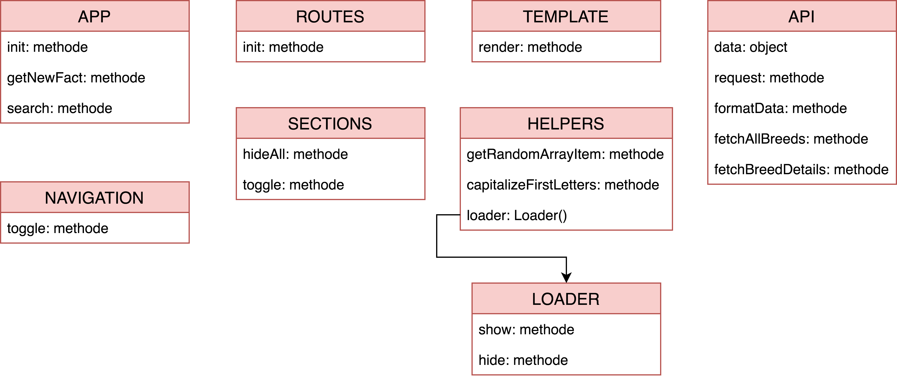

# Web App From Scratch
**Please use Google Chrome for this demo.** 
The website can be found [*here*](https://jamerrone.github.io/wafs/app/).  

For the Web App From Scratch project, we had to build a responsive, single page, web application using vanilla JavaScript only. This was quite the challenge for me, especially because I am relatively new to the language, and the fact that I never used Object Oriented Programming principals before. On the positive side, I learned a lot of new and useful stuff.

## Actor Diagram

## Interaction Diagram

## Dog API
For this project, I used the [*Dog API*](https://dog.ceo/dog-api/) made by [*Elliott Landsborough*](https://github.com/ElliottLandsborough). While this is an extremely fast API, you don't have many options or data available, in fact, the only data provided is a list containing 122 dog breeds and an array filled with images of each breed. I actually expected more data from it. For example, fur color, sizes, lifespan, etc. Especially because the data source used by this API contains a lot more information.

## Features
- Random facts about dogs.
- A large breed collection containing over 120 dog breeds.
- A detail page with lots of images for each dog breed.
- Dogs are easily found using a simple yet powerful search function.

## Whislist
 - Rewrite the code using functional programming principles.
 - Make use of separated HTML files and/or new templating/render engine.
 - Redesign the website styles.

## Dependencies/Sources
#### Libraries
- [Transparency](https://github.com/leonidas/transparency)
- [Routie](https://github.com/jgallen23/routie)
#### Data Sources
- [Dog API](https://dog.ceo/dog-api/)

## Code Reviews
#### 09/02/2018
- Cas Burggraaf: *https://github.com/Casburggraaf/wafs/pull/3*
- Mohammed 'Mo' Mulazada: *https://github.com/moniac/wafs/pull/2*

#### 14/02/1018

- Zekkie: *https://github.com/Zekkie/wafs/pull/1*
- Jamie Jansen: *https://github.com/jajan20/wafs/pull/1*

## Advantages and disadvantages of JavaScript libraries/frameworks
#### Pros:
- Het is veel sneller om werkende software te schrijven in frameworks of libraries.
- Uitgebreide lijst met gegarandeerd werkende functies.
- Frameworks en libraries worden vaak door getalenteerde mensen met veel ervaring geschreven.
- Je hoeft geen rekening te houden met oudere browsers.
- Makkelijker te beginnen en te leren vergeleken met vanilla JS.
- Frameworks en libraries creëren een standaard.
- Plugins, plugins en nog meer plugins.
#### Cons:
- Je bent enorm afhankelijk van de library en zijn updates.
- Frameworks zijn groot terwijl je vaak gebruik maakt van een klein percentage van alle beschikbare functies.
- Door gebruik te maken van libraries zijn mensen vaak minder creatief bezig, hierdoor krijg je heel veel van hetzelfde.
- Vanilla JS zal altijd sneller zijn dan frameworks of libraries.

#### Sources:
- *https://www.noupe.com/development/javascript-frameworks-94897.html*
- *https://www.quora.com/What-are-the-pros-and-cons-of-JavaScript-frameworks*

## Advantages and disadvantages of client-side single page web apps
#### Pros:
- Performance en data, de client hoeft namelijk maar 1 keer alle bestanden te laden.
- Gebruikersvriendelijker door de gebruikerservaring en immersie te vergroten aangezien je de pagina nooit herlaad.
- Met gebruik van technieken als oneindig scrollen creëer je een soepel en sneller ervaring zonder laadtijden en wachttijden.
- Voelt als een native applicatie in plaats van een website.
- Web applicaties zijn vaak makkelijker te debuggen en te onderhouden.
#### Cons:
- Javascript is noodzakelijk, sommige mensen, plugins en webbrowsers kunnen JS uit hebben staan.
- Hoewel web applicaties snel aanvoelen kunnen ze een lange laadtijd hebben in verband met zware scripts en libraries.
- SEO optimalisatie kan zeer lastig zijn en vaak kost het vele extra uren.
- In vergelijking met traditionele applicaties zijn web applicaties vaak minder veilig in verband met script injecties.
#### Sources:
- *https://medium.com/@NeotericEU/single-page-application-vs-multiple-page-application-2591588efe58*
- *https://www.uxpin.com/studio/blog/single-page-vs-multi-page-ui-design-pros-cons/*

## Best practices
- Don't use global variables/objects.
- Declare variables at top of scope.
- Use short clear meaningful names (English).
- Work in strict mode.
- camelCase your code if(code != Constructor || CONSTANTS).
- Place external scripts at the bottom of the page.
- Indent your code.
- Use 2 spaces for indentation.
- Do not use `;` (Semicolons).
- Always Declare Local Variables.
- Initialize Variables (`let myArray = []` and not `let myArray`).
- Use `===` & `!==` Comparison.
- End Your Switches with Defaults.
- Avoid Using `eval()`. (Runs strings as code.)